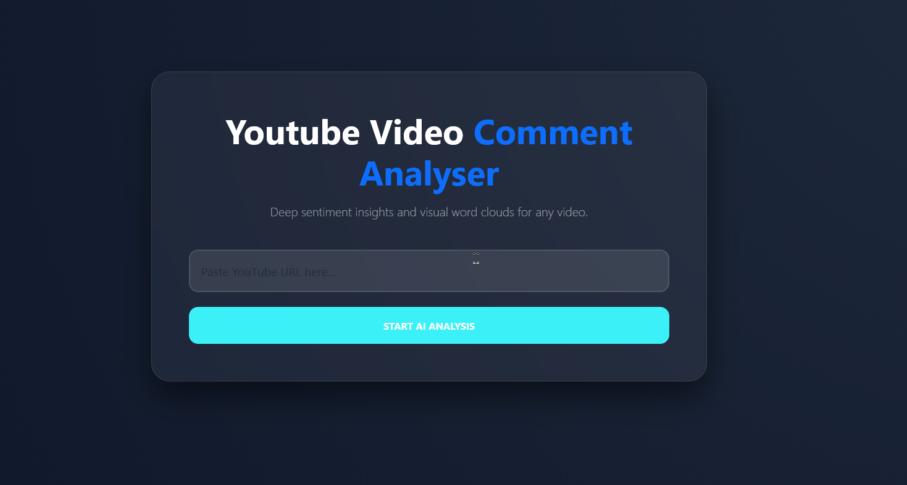
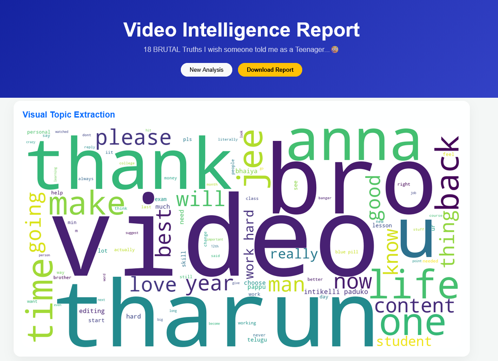
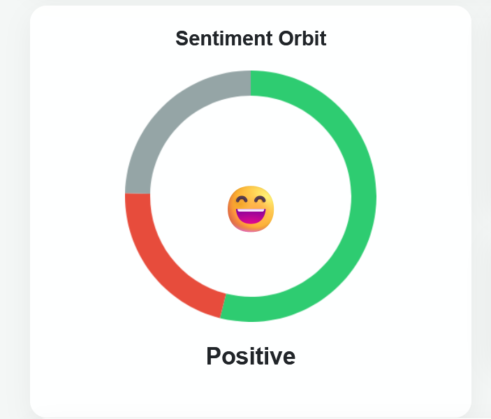
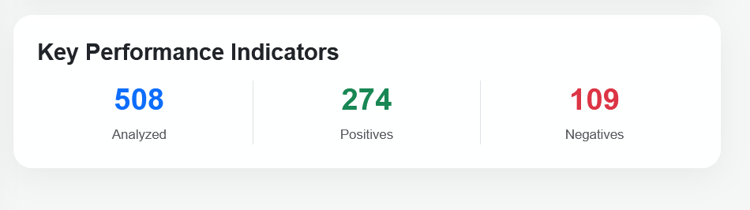
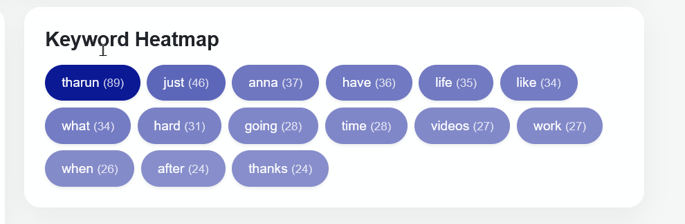
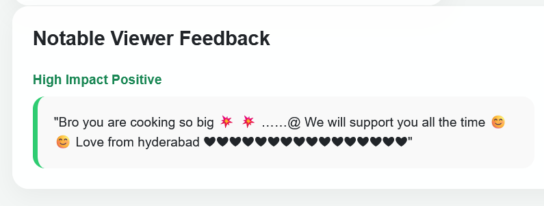
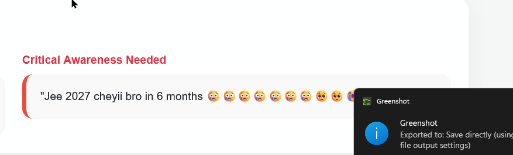

# YouTube Video Comment Analyser Tool
This tool performs deep sentiment analysis on YouTube video comments, categorizing them as positive, negative, or neutral. It generates interactive visualizations to display sentiment distribution and provides an AI-powered word cloud to highlight trending topics at a glance.




## 🎥 Demo
Here's a quick demo of the " 

## ✨ Key Features (Section Title - H2)

-**AI Sentiment Orbit**: An interactive Chart.js visualization that categorizes the overall "vibe" of a video as Positive, Negative, or Neutral using the VADER sentiment analysis engine.

-**Visual Topic Extraction**: Automatically generates a high-resolution Word Cloud to identify the most discussed subjects at a glance.

-**Keyword Heatmap**: A dynamic UI element that highlights trending words with color intensity based on frequency.

-**Viewer Feedback Highlights**: Automatically identifies and showcases the "Most Positive" and "Most Critical" comments for immediate review.

-**Automated Intelligence Reports**: One-click PDF export functionality using html2pdf.js for professional record-keeping.

-**Smart History**: A session-based tracking system that allows users to quickly re-run previous analyses without re-pasting URLs.

## 🛠️Technical Stack 

    * Jupyter Notebook / [Google Colab](https://colab.research.google.com/)
* Python 3+
* Python packages
  * Google API Client - `pip install google-api-python-client`
  * VaderSentiment - `pip install vaderSentiment`
  * Matplotlib - `pip install matplotlib`
  * Emoji - `pip install emoji`
  * Numpy - `pip install numpy`
  * Flask - `pip install flask`
  * Wordcloud - `pip install wordcloud`
* CSS3

## 🛠️ Installation & Setup

Follow these steps to get a local copy of Youtube Video Comment Analyser up and running on your machine.

1. Clone the Repository
   ```sh
      git clone https://github.com/sanuhemahd/YT-video-comment-Analyzer
    ```
2. Navigate to the project directory:
   ```sh
   cd YouTube-Comment-Analysis
   ```
3. Install dependencies:
   ```sh
   pip install -r requirements.txt
   ```
4. Set Up YouTube API

   To interact with the YouTube API, you need an API key. Follow these steps to get a YouTube API key:

    * Go to the [Google Developer Console](https://console.developers.google.com/).
    * Create a new project.
    * Enable the **YouTube Data API v3** for your project.
    * Generate an **API key** for your project.
    * Paste the generated API key into the `app.py` file under the `API_KEY` variable:

    ```python
    API_KEY = 'your_api_key_here'  # Replace with your actual API key
    
5. Run the Flask application:
   ```sh
   python app.py
   ```

6. Use the Analysis

   * Open your browser and go to `http://138.0.0.3:6000/`.
   * Enter the YouTube video URL in the provided input field.
   * Click on **"Analyze Comments"** to process the comments of the video.
   * The results page will display the sentiment analysis results along with sentiment distribution charts and wordcloud.

## ⚙️ How It Works

1. **Extract Video ID**: The process begins when a user provides a YouTube URL. The system uses a Regular Expression (Regex) to parse the string and isolate the unique 11-character Video ID.
2. **Fetch Comments**: Using the YouTube Data API v3, the application sends an authenticated request to Google’s servers. It fetches up to 1,000 top-level comments while automatically filtering out responses from the video uploader to ensure unbiased data.
3. **Clean and Filter Comments**: Raw data from the API often contains HTML entities (like &#39;) and tags. 
The system:
    Cleans the text by removing HTML tags and decoding entities into readable text.

    Filters out "spam-like" comments, such as those that are primarily emojis or contain only hyperlinks.

4. **Sentiment Analysis**: Each cleaned comment is processed through the VADER (Valence Aware Dictionary and Sentiment Reasoner) engine. VADER assigns a "Compound Score" to each string:

    Positive: Score >0.05

    Negative: Score <−0.05

    Neutral: Scores between −0.05 and 0.05

5. **Visualization & Topic Extraction**:The backend calculates the final statistics and generates visual reports:

    Charts: Dynamic Bar and Pie charts represent the percentage of each sentiment category.

    Word Cloud: A visual "Word Cloud" is generated using the most frequent terms, allowing for instant topic identification.

6. **Display Results**: The final data is rendered on a modern Glassmorphism dashboard, showcasing the overall sentiment "vibe," a keyword heatmap, and the most impactful positive and negative comments.

## 📊 Results

  

  

  

  

  

 

